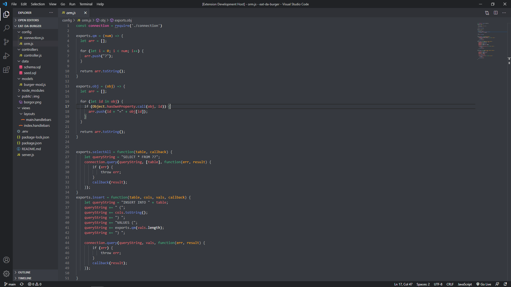

# Discord VS Theme

This theme is mainly for personal use, and was a quick side project, but if you decide to use it and enjoy it I'm glad.

As avid users of Discord my co-developer and I wanted to create a theme that resembled the platform's, as it 
is familiar to us. The formatting and color scheme are all derived from the base application.

Due to the "bland" nature of Discord's chat (all white text), there is a clear difference when taking into consideration
formatting for functions, parameters, and variables, as keeping these all white would be inconvenient for code editing. 
That being said, I'm happy with the outcome. 

